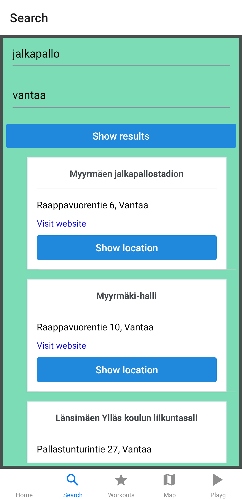
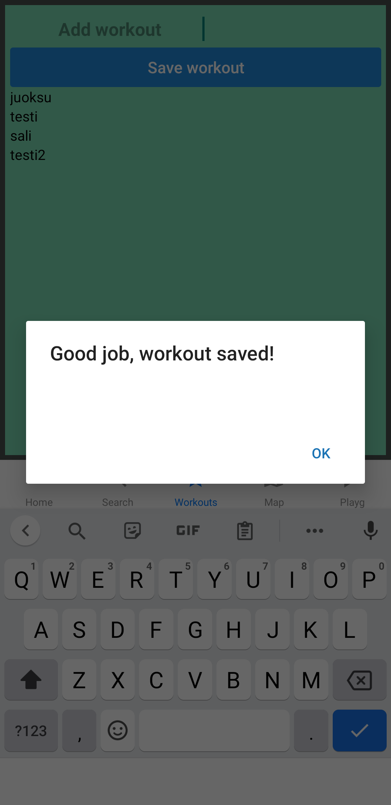

# Mobile programming course final project 

App is implemented using [expo] (https://expo.io/) and React Native.

- With this app user can browse and search sport places in Finland
- User can filter sport places by sport activity and location
- User can save her/his workouts to app. *Database feature is not at disposal*
- User can search locations using map view *Map feature is not at disposal*

## API
In this project I used [Lipas-API] (http://lipas.cc.jyu.fi/api/index.html)

## Search view

 
 
## Save workout view

 
